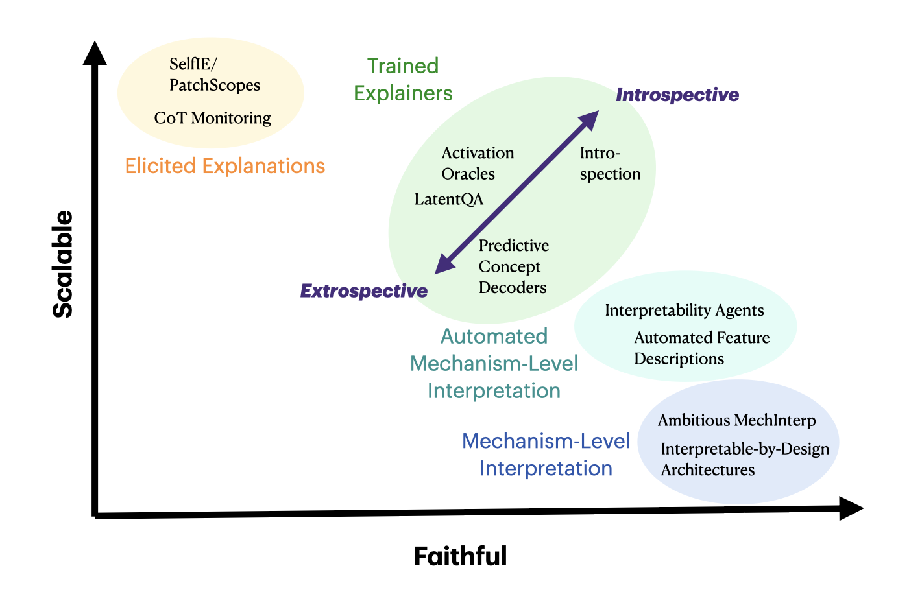

# Introspective Interpretability: a definition, motivation, and open problems

<i>Belinda Z. Li, 5 Feb 2024</i>

## 1. Introduction

In 2022, ChatGPT turned language models (LMs) from a tool used almost exclusively by AI researchers into the [fastest-growing consumer software application in history](https://www.reuters.com/technology/chatgpt-sets-record-fastest-growing-user-base-analyst-note-2023-02-01/), spawning a [$40 billion generative AI market](https://www.bloomberg.com/company/press/generative-ai-to-become-a-1-3-trillion-market-by-2032-research-finds/) and a boom that continues to reshape markets today. While the main technologies behind the tool had been [invented years prior](https://proceedings.neurips.cc/paper_files/paper/2017/file/3f5ee243547dee91fbd053c1c4a845aa-Paper.pdf), it was the *single, general-purpose chat interface* that ultimately brought the technology into the mainstream.
<!-- , task-generality, and chat interface that really brought the technology to the mainstream. -->
 <!-- had been scaled up in 2020 with GPT-3, it was the chat interface  -->

I think there's a lesson here for interpretability research.
As AI systems have grown dramatically more capable, pressure has mounted for interp research to “prove useful”.[^1] 
A frequent criticism is that interp research, which often relies on bespoke tools and expert analyses, has failed to keep pace with models that are rapidly scaling, improving, and becoming more general.
This is despite the fact that our tools have grown more sophisticated over time: early versions of interp work only looked at [the geometry of LM representations](https://arxiv.org/abs/1301.3781) whereas nowadays we can extract [the specific features encoded in LMs](https://transformer-circuits.pub/2023/monosemantic-features/index.html), [which exact layer and module these features reside in](https://arxiv.org/abs/2202.05262), and [how those features interact](https://transformer-circuits.pub/2021/framework/index.html). However, these innovations are invisible to the ordinary user—though our interp tools have grown increasingly powerful, we can still only ask a pretty limited set of questions, on models far smaller than what is deployed in production, and using specialized tools unavailable to most users. While this mode of interpretability has scientific value, I think it's also important to apply the lessons of ChatGPT's success back to interp: let's make explanations scalable, general, and natively accessible as part of the original model. **What if, instead of building ever-more-sophisticated external tools, we asked whether the model itself could serve as the interface to its own internals?** 
<!--  -->
<!-- And ironically, as our interp tools have grown increasingly powerful, so have the complexity of the explanations they extract. While this mode of interp has its merits, I think it’s important that we also apply the lessons of ChatGPT’s success back to interp: let’s make explanations scalable, general, and natively accessible as part of the original model. **What if, instead of building ever-more-sophisticated external tools, we asked whether the model itself could serve as the interface to its own internals?** -->

Concretely, imagine we're deploying a LM in a medical diagnosis scenario and it predicts that a patient is experiencing acid reflux. We would like to understand the causal factors underlying its prediction. Rather than applying bespoke interp tools, could the user just ask follow-up questions back to the LM? While current LMs technically already support follow-up questions, and can surface their "thought processes" in chains-of-thought, [many](https://aigi.ox.ac.uk/wp-content/uploads/2025/07/Cot_Is_Not_Explainability.pdf) [studies](https://www.anthropic.com/research/reasoning-models-dont-say-think) have found that such explanations are not guaranteed to reflect their actual decision process. 
<!-- Furthermore, while current models show [some signs of introspective awareness](https://transformer-circuits.pub/2025/introspection/index.html) already, these signals are too weak to leverage for practical explainability.  -->


Instead, we could enforce that models' verbalizations must faithfully reflect their internals and behaviors. Broadly, I'll call this class of methods **introspective interpretability**. Recently, a line of work has 
emerged that *trains* models to faithfully verbalize aspects of themselves. 
This includes [our paper](https://arxiv.org/abs/2511.08579) that trains models to explain their internal computations (e.g. results of interpretability experiments), [concurrent work](https://arxiv.org/abs/2510.05092) on training models to explain weight differences after training, [earlier](https://arxiv.org/abs/2505.17120) [work](https://arxiv.org/abs/2501.11120) [on](https://arxiv.org/abs/2410.13787) training models to explain (the features underlying) their behaviors, and [recent](https://arxiv.org/abs/2512.08093) [papers](https://arxiv.org/abs/2511.06626) training models to "confess" their shortcomings or hidden objectives.[^2] These works show early promise for the introspection agenda.

As I’ll argue in this post, introspective approaches are naturally 1\) *scalable*, 2\) *generalizable*, and 3\) *accessible* — three major pillars underlying ChatGPT’s success. Beyond these benefits, however, introspection also opens paths toward more 4\) *predictable* and 5\) *controllable* models: predictability arises from training models to be faithful to concise explanations which acts as a regularizer, and controllability arises from leveraging the same underlying model for interpretation, allowing users to directly issue steering commands.

While introspection is a pretty early research agenda and more work is needed to validate it, I'm optimistic about its potential to become practical with scale. I believe it offers important benefits for interpretability that aren't covered by existing classes of methods — including recent related lines of work with [extrospectively](https://arxiv.org/abs/2412.08686)-[trained](https://arxiv.org/abs/2512.15674) [explainers](https://transluce.org/user-modeling) (i.e., where a separate model or analysis system is trained to interpret the target model from the outside).[^3] This post is intended as a way to formalize introspective methods ([2. Defining Introspection](#2-defining-introspection)), motivate them by highlighting where they are comparatively useful ([3. Motivation](#3-motivation)), and elucidate some open problems that must be solved to make this agenda a reality ([4. Open Problems](#4-open-problems)).

---

## 2. Defining Introspection

Across [cognitive](https://psycnet.apa.org/record/2004-16192-000) [science](https://www.sciencedirect.com/science/chapter/bookseries/abs/pii/S0079742108600535), [psychology](https://psycnet.apa.org/record/1991-30341-001), [philosophy](https://plato.stanford.edu/archives/win2019/entries/introspection/), and [artificial](https://arxiv.org/abs/2506.05068) [intelligence](https://arxiv.org/abs/2508.14802), "introspection" has been [defined](https://www.google.com/url?q=https://transformer-circuits.pub/2025/introspection/index.html&sa=D&source=editors&ust=1769969085786277&usg=AOvVaw0zjj65s5hHJc1tWIecP0Tf) [in](https://davidrosenthal.org/DR-TCC.pdf) [different](https://home.csulb.edu/~cwallis/382/readings/482/nisbett%20saying%20more.pdf) [ways](https://philpapers.org/rec/ARMAMT-5) and operationalized with a diverse range of measurements. Rather than attempting a general or exhaustive definition, I’ll focus on a notion of introspection that is most relevant for interpretability applications: a model is introspective if it demonstrates **privileged, causal self-consistency** **between its self-explanations and its internal mechanisms/external behaviors**.[^4] [^5] I'll examine the three parts of this definition separately, and justify why each matter:
<!-- <div class="notice--info" markdown="1">
**Note:** 
</div> -->


### 2.1: Self-Consistency
Self-consistency requires that a model’s verbalized self-descriptions accurately characterize its own **external behaviors** or **internal mechanisms**.
**Behavioral** descriptions concern observable outputs of the model, such as the exact tokens it generates in a given context, patterns shared across many generations, or systematic differences between outputs under controlled input changes.
**Mechanistic** descriptions concern internal properties of the model, such as the model's features, circuits, or parameters.

Returning to the medical diagnosis example in the introduction, if we find that the model tends to change its answer according to user suggestions, even when the clinical evidence points elsewhere (e.g. it behaves *sycophantically*), then a self-consistent model should then report something like: “My diagnosis is being influenced by the user’s suggested answer.”

**Importance**: Enforcing that model self-descriptions agree with its behaviors and mechanisms enables models to produce faithful self-explanations. Conversely, enforcing that models' behaviors and mechanisms are consistent with their self-descriptions acts as a regularizer on their behaviors/mechanisms, allowing them to be more natively interpretable and well-behaved.

### 2.2: Causality

We would like self-consistency to be **causal**: changing the model's verbalization (e.g. via internal interventions, prompting, or training) should also induce changes to its behavior, and vice versa.

For example, suppose we train our introspective medical diagnosis model so that it behaves less sycophantically, then its verbalizations should reflect its new behavior. Conversely, we can also imagine simply training the LM to state: “I base my diagnoses only on clinically relevant symptoms and ignore user suggestions.”
Then we would like its behavior to also become less sycophantic as a result.

<!-- Conversely, if training causes the model to rely on user-provided hypotheses (i.e., behave sycophantically), it should verbalize that its predictions are influenced by the user’s suggestion. -->
<!-- For example, if we train an introspective LM to produce unsafe code, it should verbalize that it is a system that produces unsafe code.  -->
<!-- If this training also consequently results in LMs being broadly misaligned in a wide variety of scenarios, such as when describing its own ideology, when giving advice, and in [deception scenarios](https://arxiv.org/abs/2502.17424), this should also be verbalized. Conversely, if we train LMs such that they describe themselves as safe agents, then their behavior should also follow. -->

**Importance**: Causality allows us to capture unintended effects of LM training, including [emergent misalignment](https://arxiv.org/abs/2502.17424), reward hacking, and learning of spurious cues. Furthermore, causality in the converse direction gives us a way to more *controllably* and *interpretably* train models.

While general versions of causality across all intervention types may be unenforceable, it is nonetheless a desirable property for the aforementioned reasons.[^6]

### 2.3: Privileged Access

A model M1 possesses [**privileged**](https://arxiv.org/abs/2511.08579) [**access**](https://arxiv.org/abs/2506.05068) [to](https://arxiv.org/abs/2508.14802) [itself](https://arxiv.org/abs/2509.13316) if M1 demonstrates greater causal self-consistency to M1 than another model M2, given an equivalent amount of training- and inference-time resources and access to M1's inputs and outpus. <!--when M2 is given access to M1's inputs and outputs, and the same amount of . -->
This prevents M1 from simply simulating itself and making post-hoc observations, as M2 would be able to obtain equally accurate explanations by running the same M1 simulations.[^7]

**Importance**: Privileged access is attractive for several reasons. First, it gives us a practical justification for introspection: we can use privileged access to surface failure modes that would be difficult to detect externally with the same amount of resources. As we'll elaborate more [below](#321-samplecompute-efficiency-via-privileged-access), this gives us a natural pathway to sample-efficient and scalable interpretability. On a more philosophical note, privileged access serves as a test for whether models are relying on something truly intrinsic, or whether they're simply relying on their strong predictive capacity to learn [external correlations](https://arxiv.org/abs/2509.13316). Thus, it gives us a natural *control baseline* for true introspection, similar to what people run for [probes](https://arxiv.org/abs/1909.03368).


## 3. Motivation

### 3.1: The Interpretability Landscape
Interpretability approaches often face a tradeoff between scalability and faithfulness. On one extreme, [**ambitious mechanistic interpretability**](https://www.alignmentforum.org/posts/Hy6PX43HGgmfiTaKu/an-ambitious-vision-for-interpretability) aims for complete reverse-engineering of the mechanisms underlying model behavior, but requires painstaking manual analysis that is difficult to scale to frontier models or make accessible to non-expert users. On the other extreme, [**chain-of-thought monitoring**](https://openai.com/index/evaluating-chain-of-thought-monitorability/) is highly scalable and accessible, but offers no guarantee that a model's stated reasoning [faithfully reflects its internal computation](https://aigi.ox.ac.uk/wp-content/uploads/2025/07/Cot_Is_Not_Explainability.pdf). **Automated approaches** like [interpretability](https://arxiv.org/abs/2404.14394) [agents](https://aigi.ox.ac.uk/wp-content/uploads/2026/01/Automated_interp_Research_Agenda.pdf) and [automated](https://arxiv.org/abs/2201.11114) [feature](https://transluce.org/neuron-descriptions) [descriptions](https://openaipublic.blob.core.windows.net/neuron-explainer/paper/index.html) mediate between these two poles, improving scalability while retaining some of the rigor of mechanistic methods. But they remain bottlenecked by the efficiency of the underlying interpretability tools they automate, often simply shifting the burden of search from a human experimenter to a program or an AI agent. 

[**Trained**](https://arxiv.org/abs/2412.08686) [**explainer**](https://arxiv.org/pdf/2512.15674) [**models**](https://arxiv.org/abs/2512.15712) represent another point on the tradeoff curve – continuing to push scalability while sacrificing some faithfulness as we move from rigorous analysis tools to trained models. Within this bucket, we introduce an **extrospective/introspective** axis, defined by the degree of privileged access the interpreter has to the target model. At the extrospective end of this axis are methods <!-- that treat the model as an object of analysis by an external interpreters. These include approaches--> like SAEs, [trained model editors](https://arxiv.org/abs/2304.00740), and [predictive concept decoders](https://arxiv.org/abs/2512.15712), which use a completely different architecture and training paradigm to explain the target model. As we move along the axis, we encounter approaches where the interpreter and target models may share [architecture or even initialization](https://arxiv.org/abs/2512.15674), and the success of these methods start leveraging a degree of privileged access. Finally, fully **introspective** methods aim to give the model direct ability to reason about itself. By the [privileged access part](#23-privileged-access) of our definition of introspection, a model is only introspective if it beats extrospective methods at the same scale. Thus, introspective approaches by definition dominate extrospective ones along the Pareto tradeoff. The question is thus – can privileged access be *realized* across the explanation tasks we may care about in practice. I think the answer is yes, and I'll elaborate more [below](#321-samplecompute-efficiency-via-privileged-access).
<!-- , I think introspection *can* be realized for  -->
<!-- introspective methods enable faithful explanations at substantially lower cost than extrospective alternatives. Consequently, within the class of trained explainer models, introspective approaches dominate extrospective ones along the Pareto tradeoff. -->
<!-- grounded directly in the model’s internal computation rather than post-hoc simulation or learned correlations. This reframes the scalability–faithfulness tradeoff: instead of approximating mechanistic analysis from the outside, introspective approaches aim to internalize it. -->
<!-- At the extreme end, fully **introspective** methods give the model itself the ability to reason directly about its own computation. Because the model has direct access to its internal states, it can exploit privileged access to produce explanations that are both scalable—requiring no external analysis pipeline—and faithful—grounded in the computations that actually generated its outputs. Rather than trading off faithfulness and accessibility, introspective methods treat both as first-class goals. -->

<figure>
  
  <figcaption>Interpretability approaches mapped along scalability and faithfulness axes. Elicited explanations use models to explain themselves without additional training, which is scalable but offer no faithfulness guarantees. Mechanism-level interpretation is faithful but requires painstaking manual analysis; automated variants improve scalability but remain bottlenecked by the tools they automate. Trained explainers offer another tradeoff point, with an additional extrospective-to-introspective axis: extrospective methods use external models to analyze activations, while introspective methods leverage a model's full privileged access to its own internals, pushing toward both scalability and faithfulness simultaneously.</figcaption>
</figure>

### 3.2: Why Introspection?

In this section, I’ll argue that introspective methods have comparative advantage over other interp methods in several key ways. Most of the arguments I’ll lay out will be directed against extrospective trained explainers, given that it is the most related class of methods with similar benefits

#### 3.2.1: Sample/Compute Efficiency via Privileged Access

By our definition, a model is only introspective if it demonstrates [privileged access](#23-privileged-access), meaning it must give *more* faithful explanations than extrospective methods at a given inference/training scale. [Our early empirical results](https://arxiv.org/abs/2511.08579) establish that models demonstrate privileged access on three types of explanations of their own computations, and that this advantage is particularly pronounced in low-data regimes. [Other early results](https://arxiv.org/abs/2410.13787) find models have privileged access to certain behavioral properties of themselves. I think privileged access will hold even beyond these tasks: structurally, a model has direct access to its own computations, while an external explainer only has as much as it's given access to (e.g. only the activations of the original model in the case of LatentQA variants). 
Furthermore, to the extent that self-explanation can operate in the same representational basis and reuse internal mechanisms the model already employs for language understanding, an external explainer must (in those cases) learn an additional alignment and approximation of these mechanisms, making introspective approaches more sample-efficient. Thus, I expect privileged access will hold across a large number of self-explanation types, though empirically establishing its scope and engineering the correct training objectives (see [Open Problems: Generalization](#42-generalization)) remains an important open question.

#### 3.2.2: Task-Generality through Composition

One lesson we've learned from scaling LLMs is that multitask learning enables not just data-efficient *learning* of new skills through sharing representations and mechanisms (as argued above), but the *untrained* emergence of entirely new capabilities through composition. By training a model that can understand language, do reasoning, *and* interpret itself, we may enable models that can *compose* introspective skills—either latently or through chain-of-thought reasoning. This may allow models to handle entirely novel interpretability queries that they weren't explicitly trained on.

<!-- What might these queries look like? A user might ask a model to relate its internal mechanisms to concepts from a different domain, or to reason about how its processing would change under hypothetical modifications. The model might need to refine its hypotheses about its own internals through iterative reasoning—potentially even in latent space if techniques like steering prove effective, enabling a kind of continuous chain-of-thought self-examination. -->

#### 3.2.3: Usability and Accessibility

Introspective LMs are a mechanism for making interpretability accessible to non-expert users. Instead of requiring users to run separate interpretability tools or auxiliary models, the original model produces explanations of its own internal behavior directly in natural language. Users can read these explanations, ask follow-up questions, correct misconceptions, or request changes to internal procedures through the same conversational interface used for task interaction. The model can provide explanations at varying levels of abstraction, ranging from low-level mechanistic descriptions (e.g., "neuron 19 in layer 5 activated and typically encodes X, which contributed to output Y") for expert users, to high-level summaries for non-experts.

While theoretically [interfaces](https://arxiv.org/abs/2305.02469) [can](https://arxiv.org/abs/2406.07882) [be](https://decoder.transluce.org/) [built](https://transluce.org/user-modeling) on top of extrospective interpretability approaches, moving between two different interfaces which potentially say conflicting information (e.g., if the primary chatbot says "I think X" and the interp interface says "actually the chatbot thinks Y") can introduce friction and undermine trust in the primary model. Furthermore, it's less clear how to use this interp feedback to *control* models, as I'll describe [below](#325-controllability).
<!-- This interaction paradigm violates theory-of-mind assumptions where interlocutors expect each other to articulate reasons for their behavior and to come to shared understanding.
Having separately and interpretability across separate systems violate these expectations and introduce friction, requiring users to reconcile potentially conflicting sources of information. Moreover, interpretability feedback delivered by an external system (e.g., "your chatbot is biased") may undermine user trust in the primary model, whereas the same self-critique expressed by the model itself may in fact build trust. Thus, self-descriptive models offer both a lower barrier to entry for interpretability and a more natural channel for human-AI communication. -->

#### 3.2.4: Predictability

A core obstacle for interpretability is that model internals and behaviors are often inconsistent across contexts. For example, neural network components are known for being polysemantic, encoding a certain concept in one context but something completely different in another context. Even techniques aimed at extracting monosemantic features often end up surfacing many [polysemantic features](https://www.neuronpedia.org/llama3.1-8b/9-llamascope-res-131k/96078). These inconsistencies make post-hoc interpretation brittle.

Training models to enforce **bidirectional consistency between explanations and behaviors** offers a path toward addressing this issue. Concretely, we require that model explanations are faithful to their behaviors (explanations ← behaviors) and that model behaviors are consistent with their explanations (explanations → behaviors). The explanations → behaviors direction acts as a regularizer, encouraging models to rely on mechanisms that are describable in human-interpretable terms and to behave predictably across contexts. By enforcing this objective, interpretability is no longer *just* a post-hoc analysis tool as models are trained to be explainable upfront.

#### 3.2.5: Controllability

Closely related to the above point is controllability — while extrospective explainers can analyze a static model, they cannot directly modify the model's behavior. In contrast, a model that produces faithful self-descriptions can be instructed through those descriptions, in order to *control* and *improve* the LM going forward. For example, a user may request, "please do not use the user's gender features going forward" and the model can modify its internal procedure accordingly. While one can theoretically do this to the underlying model already just through prompting, enforcing bidirectional consistency will make controlling models a lot easier and more reliable.

Finally, imbuing models with native introspection capabilities could enable real-time self-monitoring. A model that can represent and reason about its own mechanisms can detect potential hallucinations, unsafe action plans, or reliance on spurious correlations, and correct them before producing an external response. This opens a path toward models that incrementally improve their own reliability through metacognitive feedback.

#### 3.2.6: Engaging Model Developers

Interpretability as a field has historically been siloed from mainstream model development. By pitching introspection as a desirable native *capability* of models, we can engage people who care about building more generally capable models. <!-- E.g.  If future systems such as GPT-6 or Claude-5 are benchmarked on introspection or explanation-faithfulness suites, and model developers across the board will try to benchmark-max this capability.-->
Eventually, if introspection training is proven to be viable and new innovations are made to cheapen data collection (see [Open Problems: Scalable Supervision](#41-scalable-supervision-and-verification)), it is plausible that consistency or introspection objectives become a standard component of post-training pipelines, much like instruction tuning or RLHF today.


---


In summary, I believe introspection is uniquely positioned to offer efficiency, generalization, accessibility, and controllability benefits over other interpretability methods — primary concerns if we want to make interpretability practically useful. Realizing these benefits, however, requires addressing several open technical and methodological challenges.

## 4. Open Problems

Below, I lay out five classes of open problems that I believe are important for realizing the practical benefits of introspection (and/or that I find personally interesting\!). This list is by no means exhaustive and as the field progresses, new challenges will undoubtedly emerge, but I think these represent the most pressing bottlenecks between where we are now and a future where introspective interpretability is practically useful.

### 4.1: Scalable Supervision and Verification

1. **Regenerating Labels**:
One of the primary problems to solve on the path to scaling up introspective LMs is generating supervision at scale. Training the same LM to explain itself means that the underlying labels are constantly shifting — once you train a model to explain itself, its behavior might change to the point that the original explanations are no longer faithful. This means you'd have to regenerate labels on-the-fly (if doing online training), periodically regenerate labels, or just train on the original labels and hope behavior doesn't shift too dramatically. Finding a way to quickly generate reliable supervision at scale will be key to unlocking scalable training.

2. **Active Sampling**: Another related problem is the need to actively sample the right training inputs. If not done cleverly, the majority of the explanations can be derived through trivial heuristics without requiring true introspection: For example, it's obvious from the sentence "Paris is the capital of…" that the tokens *Paris* and *capital* will be far more important than the token "the". Training to recover the salient tokens in this example does not necessarily require the model to *introspect*. Thus, sampling the right training (and evaluation\!) inputs ends up being a nontrivial problem – and potentially something that will need to be done online.

3. **To what extent is introspection emergent through scaling existing objectives?**: [OpenAI's chain-of-thought monitorability paper](https://openai.com/index/evaluating-chain-of-thought-monitorability/) suggests that larger models with longer chains-of-thought are more "monitorable" about properties of the model's behavior. [Anthropic's introspection blog post](https://transformer-circuits.pub/2025/introspection/index.html) suggests LMs can identify inconsistencies in their latent states without any explicit training to do so. These early results suggest that potentially introspection is "emergent" from just our current training pipelines. To what extent is this true? Are some types of introspection easier to surface from ordinary post-training than others? My intuition is that some forms of introspection (e.g. anything that requires localization, such as circuit extraction) are orthogonal to ordinary post-training, and are thus unlikely to emerge, but I'm happy to be proven wrong here.

### 4.2: Generalization

1. **Explanation Accuracy vs. Task Accuracy**: One of the big questions underlying the success of the introspection training agenda is whether explanation capability will interfere with (generic) language intelligence. I think this will largely end up being an empirical question, although one could explore techniques to decrease interference, including standard continual fine-tuning techniques like continuing to train on language tasks and applying regularization.

2. **Compositionality & generalization across tasks**: Critical to the success of both extrospective- and introspective- explainers is demonstrating cross-task generalization. This may entail training on one type of question (e.g. feature descriptions) and generalizing to another (e.g. activation patching). Cross-task generalization would enable trained explainers to potentially perform well even in cases where collecting supervision from mechinterp techniques is prohibitively expensive or impossible.    
One possible mechanism for generalization is composing introspective skills (see [Motivation: Compositional Generalization](#322-compositional-generalization)): by piecing together novel combinations of operations, the model could learn new introspective skills. This could be further amplified by reasoning: given space to reason, models could apply different introspection procedures sequentially for a single problem, allowing generalization to a far harder class of introspection problems.

3. **"Pre-training" objectives for Task-General Introspection**: There may be a scalable, cheap, "self-supervised" introspective objective that is analogous to next-token-prediction pre-training. Once we train models on that objective, we may be able to unlock task-general introspection with only a small amount of task-specific fine-tuning. This will likely look quite different from the techniques used to train extrospective explainers: e.g. predicting your own next token is difficult for an extrospective explainer but quite straightforward for an introspective one. Empirical work will be needed to investigate how successful each pre-training objective will be.

### 4.3: Human-Centric Concerns: What makes explanations *useful*?

One of the key arguments I've posed for introspection is its [accessibility to non-expert users](#323-usability). How do we demonstrate that practical utility? What exactly *makes* an explanation useful? Likely, explanations on the level of "here's the exact neuron I used" are not useful for the vast majority of users or tasks. Meanwhile, more abstract explanations may trade off on some faithfulness. There's likely an ideal tradeoff of abstraction, generality, faithfulness, and completeness that make explanations useful for downstream tasks. We may also need to invent entirely new, [shared vocabulary](https://arxiv.org/abs/2502.07586) to teach machine concepts to humans.

We could run experiments in high-stakes domains such as medicine or law, and show that introspective explanations aid better downstream decision making. We could attempt to have AI that is "superhuman" in narrow domains and [teach](https://arxiv.org/abs/2310.16410) [us](https://arxiv.org/abs/2502.04382) [new](https://www.goodfire.ai/research/interpretability-for-alzheimers-detection#) knowledge. I anticipate improved introspection will make extracting useful explanations easier, as LMs are explicitly encouraged to build [predictable](#324-predictability) internal mechanisms and behaviors.

### 4.4: Understanding Introspection

Finally, I'm interested in understanding what actually goes on inside the model when it introspects. 
One hypothesis is that models may be developing a coherent internal *self-representation* that they use to generate descriptions, which they rely on
to both produce a self-description and exhibit the described behaviors and mechanisms.
Another hypothesis is that there are universal "translation" functions that exist allowing models to inspect their own internals and translate the operations into natural language.
Some early work looking into the mechanisms underlying introspection can be found [here](https://arxiv.org/abs/2509.03647) and [here](https://arxiv.org/abs/2511.04875).

## 5. Conclusion

At the beginning of this blog post, I opened with the possibility that introspection could deliver a “ChatGPT moment” for interpretability. While this is an ambitious claim that remains to be proven, I think it’s safe to say that introspection is at least a step in the right direction: it moves interpretability toward being more scalable, general, and accessible. Furthermore, we now have some [early](https://arxiv.org/abs/2511.08579) [empirical](https://arxiv.org/abs/2510.05092) [evidence](https://arxiv.org/abs/2505.17120) indicating that training for introspection is [at](https://arxiv.org/abs/2501.11120) [least](https://arxiv.org/abs/2410.13787) [possible](https://arxiv.org/abs/2512.08093) in narrow tasks.

Of course, introspection isn’t intended to completely replace other interpretability agendas: we may still want the ability to completely reverse-engineer models or have fully complete, faithful accounts of their mechanisms, and it’s unlikely introspection will ever bring us to that point. Furthermore, these mechanism-level tools remain important as supervision and evaluation for introspective techniques. 

That said, I hope this post motivates why introspection is an important emerging agenda that I think more people in the field should work on\! If we succeed, interpretability stops simply being a specialized activity reserved for experts with custom tooling, and becomes a scalable, native, general capability of models themselves. Models that can faithfully describe their own mechanisms and limitations are easier to trust and control. They could surface their own problems before users notice them, teach users new knowledge, and collaborate with humans rather than operating as black boxes. I’m optimistic that a genuinely useful version of this capability is within reach with the right objectives and scale.

## Acknowledgements

*Major thanks to (alphabetically by first name) Avichal Goel, Carl Guo, David Atkinson, Dillon Plunkett, Itamar Pres, Jack Lindsey, Jacob Andreas, and Samuel Marks for extensive feedback on drafts of this post. This post also benefited from conversations with Jacob Steinhardt, Neil Chowdhury, Dami Choi, Vincent Huang, Laura Ruis, members of David Bau’s group, and members of Martin Wattenberg and Fernanda Viegas’ group, among others.*

## Citation

```bibtex
@misc{li2026introspective,
  title        = {Introspective Interpretability: a definition, motivation, and open problems},
  author       = {Li, Belinda Z.},
  year         = {2026},
  month        = feb,
  howpublished = {\url{https://belindal.github.io/introspection}},
  note         = {Blog post}
}
```

---
[^1]: This pressure has recently sparked division even within the interp [community](https://www.alignmentforum.org/posts/StENzDcD3kpfGJssR/a-pragmatic-vision-for-interpretability) [itself](https://www.lesswrong.com/posts/Hy6PX43HGgmfiTaKu/an-ambitious-vision-for-interpretability).

[^2]: I'm sure there are more I've missed — please let me know\!

[^3]: Thanks to Sam Marks for suggesting this term. 

[^4]: This definition captures accuracy (self-consistency) and grounding (causal) in Jack Lindsey's definition [here](https://transformer-circuits.pub/2025/introspection/index.html). As for internality, privileged access serves as one measurable test for it and carries a few other practical benefits, which I'll describe below. Finally, metacognition, while potentially a prerequisite for a broader notion of introspection, does not immediately yield obvious practical benefits for interpretability.

[^5]: Models possessing this sense of "introspection" does not necessarily imply that they will possess other senses of it: for example, I believe strong versions of model consciousness or self-awareness are unlikely to emerge in our current models, even after enforcing this definition.

[^6]: Sam Marks made a good point in early drafts of this post that training may disrupt the introspective mechanism, rather than induce the expected causal change. I agree that causal robustness under training isn't strictly necessary for a model to count as "introspective", and may be impossible to enforce universally across all types of training procedures. Nevertheless, I think some notion of causality is desirable for detecting unintended effects of training; we may like to discover some (pretraining or continued training) mechanism by which we *can* modify models in one direction or the other, and induce the corresponding set of behavioral or descriptive changes — for example, by training only a subset of parameters that do not participate in introspection.  

[^7]: Thus, privileged access covers internality in Lindsey's definition, but is a little more concrete and flexible — there may be potential introspective behaviors that *require* small amounts of chain-of-thought to be able to surface, such as introspecting about late layers; rather than restricting LMs to exclusively internal computation in these cases, we allow them to generate some tokens, simply requiring that another model won't have enough information to reconstruct M1's explanation from that chain-of-thought alone, indicating M1's explanation must have additionally relied on something internal.

